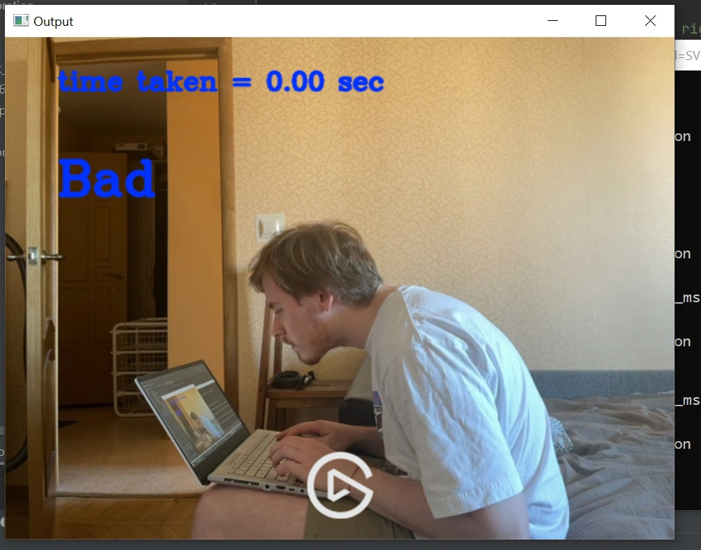

# Monitoring the correct posture of a person at the workplace

## Requirments 

You need:

- python3
- opencv2 (i use version 4.5.2)
- numpy (1.20.1)
- joblib

You also should install this folder https://yadi.sk/d/WL1yTGdZiNdyTw to folder ./models/OpenPose and this 
video https://yadi.sk/i/tf3VepLuGMnUeg to folder ./test/video

## Usage

Clone this repo and open Check_Video.py

```
$ git clone https://github.com/danyaliv/correct-posture.git
$ python Check_Video.py --device --input_source --output_file --model
```

Available arguments:

device: 'cpu' or 'gpu'

note: to use gpu on windows you need to built opencv with gpu support 
https://haroonshakeel.medium.com/build-opencv-4-5-1-with-gpu-cuda-support-on-windows-10-without-tears-cf0e55dc47f9
(only for nvidia cards)

input_source: path for video or 0 for webcam 

output_file: path and name for output video (if use video as input)

model: used pre-trained classification model ('SVM' or 'CatBoost'), SVM work better

## Output result

